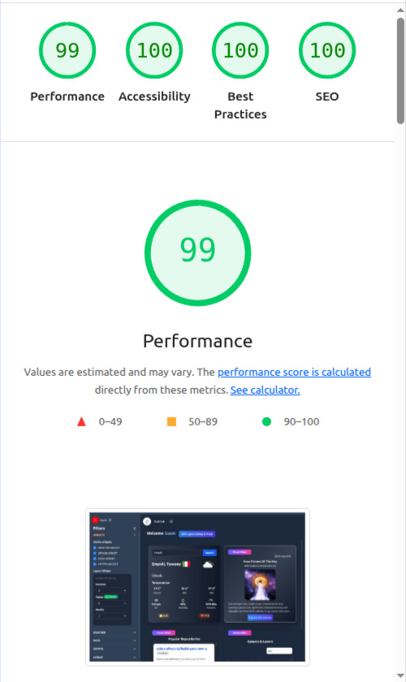
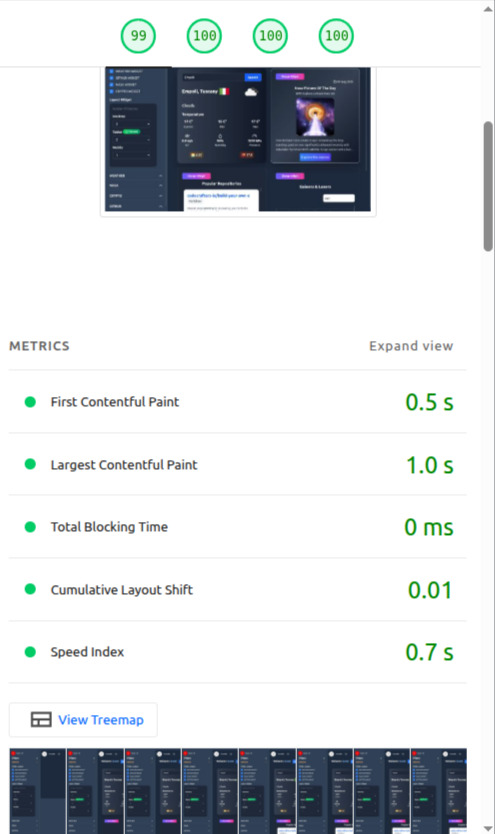

# DashHub: Centralized Dashboard Hub

**DashHub is a modular, responsive dashboard built with React and Redux, featuring a secure backend that aggregates real-time data from NASA, Crypto, Weather, and GitHub APIs. Fully customizable, it demonstrates advanced frontend skills alongside real full-stack capabilities.** 

**Live Demo:** 👉 [**dashhub.up.railway.app**](https://dashhub.up.railway.app)

## Core Features & User Experience

DashHub provides a high level of personalization and control over the user interface, driven by a robust architecture.

Features include dynamic drag & drop, theme switching, persistent layouts, and real-time API integrations.

### User Customization and Control

| Feature                      | Description                                                                                                            | Highlight                                                                                       |
| :--------------------------- | :--------------------------------------------------------------------------------------------------------------------- | :---------------------------------------------------------------------------------------------- |
| **Dynamic Drag & Drop**      | Users can fluidly rearrange and reposition widgets on the grid using intuitive mechanics.                              | **Manually Implemented** (demonstrating deep DOM and state control).                            |
| **Persistent Configuration** | All user preferences including widget positions, visibility, and layout settings are saved and loaded across sessions. | Ensures a consistent, personalized experience, **persisting configurations via Local Storage.** |
| **Flexible Layout**          | Users can select the optimal **number of columns** for the widget grid.                                                | Guarantees adaptability across all screen sizes.                                                |
| **Theme Switching**          | Seamless transition between **Light and Dark Mode**.                                                                   | Enhances accessibility and user preference.                                                     |
| **Widget Management**        | A centralized control panel allows users to **show, hide, and reorder** specific widgets dynamically.                  | Maximum user control over displayed data.                                                       |
| **Responsiveness**           | Optimized and fully accessible on desktop, tablet, and mobile devices.                                                 | Standard for modern web applications.                                                           |

## Technical Architecture

### Frontend Layer: State and Modularity

- **Centralized State Management (Redux/Redux Toolkit):** Manages the entire application state, encompassing complex UI configurations, user preferences, and widget data, ensuring high reliability and maintainability.
- **Global Notification and Error Handling:** Implemented a unified system for managing alerts and errors, centrally governed by Redux. This ensures the user receives **immediate feedback** (e.g., success notifications for completed actions) and that critical errors are handled gracefully.
- **Highly Modular Structure:** Implements a sophisticated, multi-layered component architecture:
  - **Main Widgets:** High-level containers for data categories (e.g., `Crypto`, `Nasa`, `Github`).
  - **Nested Sub-Widgets:** Each main widget can contain multiple granular components (e.g., 3 internal sub-widgets per main widget), promoting **reusability** and detailed data presentation.

### Backend Layer: Security and Data Operations

The dedicated backend service is crucial for security, efficient data handling, and showcases **Full-Stack competency**.

| Component                | Responsibility                                                                                                                  | Technical Highlight                                          |
| :----------------------- | :------------------------------------------------------------------------------------------------------------------------------ | :----------------------------------------------------------- |
| **Secure API Proxy**     | Proxies all external API calls. The server handles all **sensitive API keys**, ensuring they are never exposed to the frontend. | Enhanced Security Model.                                     |
| **Data Aggregation**     | Consolidates data from multiple sources to optimize payload size and minimize client requests.                                  | Performance Optimization.                                    |
| **Data Synchronization** | A daily **Cron Job** runs automatically at midnight to update and synchronize cryptocurrency collection data.                   | Ensures data freshness and availability.                     |
| **Middleware & Logging** | A custom middleware intercepts all requests to save comprehensive logs (access, timings, errors).                               | Provides a crucial Audit Trail for monitoring and debugging. |

## Data Integration & Widget Types

DashHub acts as a single, secure interface, featuring highly specific widgets powered by external APIs.

| Data Source     | Main Data Category              | Example Widgets Available                                                                           |
| :-------------- | :------------------------------ | :-------------------------------------------------------------------------------------------------- |
| **NASA API**    | Astronomy and Space Exploration | **Pic Of The Day**, **CME** (Coronal Mass Ejection), **Near Earth Object** tracking.                |
| **Crypto APIs** | Real-time Market Data           | **Trending Cryptos**, **Crypto Details** (for individual coins), **Top Cryptos** (market cap list). |
| **Weather API** | Geolocation-based Conditions    | Current weather conditions (e.g., Temperature, Humidity, Wind).                                     |
| **GitHub API**  | Developer Workflow & Activity   | **Trending Repositories**, **User Activity** (commits/issues), **Random User** finder.              |

## Tech Stack

This project is primarily a **Frontend showcase** but demonstrates proficiency in a robust Full-Stack environment.

| Area         | Component        | Technology / Implementation | Note                                          |
| :----------- | :--------------- | :-------------------------- | :-------------------------------------------- |
| **Frontend** | Framework        | React                       |                                               |
|              | State Management | Redux / Redux Toolkit       |                                               |
|              | Styling          | **Tailwind CSS**            | Utilized for rapid and utility-first styling. |
|              | Drag & Drop      | **Manually Implemented**    | Demonstrates core JavaScript/React skill.     |
| **Backend**  | Runtime          | Node.js                     |                                               |
|              | Web Framework    | Express                     |                                               |
|              | API Client       | Fetch                       |                                               |
|              | Logging          | Custom Middleware           |                                               |

## Performance & Optimization Highlights

 

| Area                        | Description                                                                                         | Technical Detail                                                 |
| :-------------------------- | :-------------------------------------------------------------------------------------------------- | :--------------------------------------------------------------- |
| **Lighthouse Optimization** | Achieved high scores in **Performance, SEO, Best Practices, and Accessibility**.                    | Screenshots below show audit results across all key metrics.     |
| **Backend Proxy Caching**   | Implemented an **Express-based proxy layer** to cache API and image responses.                      | Reduces API latency and improves image delivery speed.           |
| **Lazy Loading**            | Applied lazy loading to critical components.                                                        | Boosts initial load time and reduces bundle size.                |
| **Vite Build Optimization** | Customized **Vite configuration** for bundle splitting, minification, and optimized asset delivery. | Significantly improved loading performance and build efficiency. |
| **Dockerized Environment**  | Both frontend and backend have dedicated **Dockerfiles** published on personal Docker Hub repo.     | Enables full environment replication and simplified deployment.  |
| **LCP Preload Optimization** | Implemented a **custom React hook** to ensure preloading of critical assets impacting the Largest Contentful Paint. | Improves perceived load time and boosts Lighthouse performance metrics. |

## Lighthouse Audit

Dashhub achieves **high scores** across all Lighthouse metrics 
**Performance, Accessibility, Best Practices, and SEO** reflecting a strong focus on optimization, code quality, and user experience.
Optimized through Vite bundle splitting, lazy loading, proxy caching, and Dockerized builds.

### Lighthouse Scores

### Performance Scores

# Visual Demo

These demos highlight the most critical features that define DashHub's advanced user experience and full-stack capabilities.

### 1. Dynamic Layout Management

This GIF showcases the ability to fluidly drag, drop, and reposition any widget on the grid. This feature, which was **manually implemented** (without external libraries), is critical proof of deep React/DOM and state management expertise.

### 2. Centralized Control and Configuration Persistence

These animations demonstrate the centralized control panel in action, showing how users can toggle widget visibility, adjust the column layout, and how these settings are immediately persistent via Local Storage.

